<p align="center">
  
</p>

<p align="center">
  <a href="https://mariourenagarcia.github.io/piedra-papel-tijera/">
    
  </a>
</p>

<p align="center">
  
  
  
  
</p>

<p align="center">
  Juega piedra, papel o tijera con tu cámara contra una máquina que ve tu mano en tiempo real<br>
  y responde con la jugada ganadora antes de que alcances a notarlo.
</p>


## Cómo gana siempre

<p align="center">
  
</p>

1. La cuenta regresiva dice **Piedra, Papel, Tijera, Ya!**
2. Al llegar a **Ya!** la máquina observa tu mano cuadro por cuadro.
3. En cuanto tu gesto se mantiene igual durante **3 cuadros seguidos**, elige la jugada que lo vence.

<p align="center">
  
</p>

Todo eso tarda alrededor de 100 ms. Una persona necesita más de 200 ms para notar un cambio, así que a simple vista parece que ambos jugaron al mismo tiempo.


## Cómo reconoce el gesto

<p align="center">
  
</p>

[MediaPipe Hands](https://ai.google.dev/edge/mediapipe/solutions/vision/hand_landmarker) encuentra 21 puntos de la mano. Un dedo cuenta como estirado si su punta queda bastante más lejos de la muñeca que su nudillo medio. Medir distancias a la muñeca, en lugar de alturas, permite que funcione con la mano girada o de lado. El pulgar se ignora porque cada persona lo pone distinto y no cambia cuál de los tres gestos es.

| Dedos estirados (sin contar el pulgar) | Gesto      |
| :------------------------------------- | :--------- |
| Ninguno                                | **Piedra** |
| Índice y medio                         | **Tijera** |
| Tres o cuatro                          | **Papel**  |


## Controles

| Tecla     | Acción                  |
| :-------- | :---------------------- |
| `Espacio` | Jugar una ronda         |
| `A`       | Modo automático         |
| `R`       | Reiniciar marcador      |
| `M`       | Activar o quitar sonido |

## Correrlo en tu equipo

La cámara solo funciona en `https` o en `localhost`, así que abrir el archivo con doble clic no sirve. Levanta un servidor local en la carpeta del proyecto:

```bash
python -m http.server 5500
```

y abre `http://localhost:5500`.

## Publicarlo en GitHub Pages

1. Sube el repositorio a GitHub.
2. En **Settings > Pages**, elige **Deploy from a branch**, rama `main` y carpeta `/ (root)`.
3. En un minuto queda publicado en `https://<tu-usuario>.github.io/<repositorio>/`.

No hay paso de compilación: son archivos estáticos.

## Estructura

```
index.html        estructura de la página e iconos SVG
css/styles.css    estilos
js/app.js         cámara, modelo, bucle del juego e interfaz
js/logic.js       clasificación del gesto y reglas, sin dependencias del navegador
assets/           favicon e imágenes de este README
```

## Ajustes

| Qué pasa                                          | Qué cambiar                          |
| :------------------------------------------------ | :----------------------------------- |
| Confunde gestos con dedos medio doblados          | Sube `EXTEND_RATIO` en `js/logic.js` |
| Responde antes de que termines de formar la mano  | Sube `STABLE_FRAMES` en `js/app.js`  |
| La cuenta regresiva va muy rápida o muy lenta     | Cambia `STEP_MS` en `js/app.js`      |


<p align="center">
  <a href="https://mariourenagarcia.github.io/piedra-papel-tijera/">
    
  </a>
</p>
