<p align="center">
  
</p>

<p align="center">
  <a href="https://mariourenagarcia.github.io/piedra-papel-tijera/">
    
  </a>
</p>

<p align="center">
  
  
  
  
  
</p>

<p align="center">
  Juega piedra, papel o tijera con tu cámara. La máquina sigue tu ritmo, lee tu mano mientras se abre<br>
  y elige su jugada antes de que termines la tuya. Después valida lo que de verdad jugaste.
</p>



## Cómo se juega

Hay tres formas de empezar, igual que en persona:

| Forma           | Qué hacer                                                                 |
| :-------------- | :------------------------------------------------------------------------ |
| **Con la mano** | Agita el puño tres veces. Cada golpe marca piedra, papel y tijera, y lanzas en el siguiente. |
| **Con la voz**  | Activa **Voz** y di «piedra, papel, tijera». También entiende «un, dos, tres» y «ya». |
| **Con teclado** | Pulsa `Espacio` para un conteo automático.                                |

<p align="center">
  
</p>


## Cómo predice tu jugada

La máquina combina dos fuentes antes de que tu gesto esté terminado:

1. **Tu historial.** Las personas no juegan al azar. Se cuenta qué sacas después de tu última jugada y de tus dos últimas, y se mezcla con tu frecuencia general. El historial se guarda en tu navegador, así que aprende de una partida a otra.
2. **La lectura temprana de tu mano.** Cada dedo se mide de forma continua, de 0 (cerrado) a 1 (estirado). En cuanto índice y medio empiezan a separarse ya se sabe que no es piedra, y lo que hagan anular y meñique distingue papel de tijera. La piedra no se puede leer por la forma, porque el puño ya está cerrado mientras se agita, así que solo se acepta cuando la mano termina el lanzamiento sin abrirse.

Ambas se combinan con la regla de Bayes. Cuando la jugada más probable supera el 86% durante dos cuadros seguidos, la máquina elige lo que la vence.

<p align="center">
  
</p>

## Cómo valida lo que jugaste

Decidir antes no sirve de nada si la jugada no se confirma. Después de elegir, la máquina sigue mirando hasta que tu mano queda **quieta y con el mismo gesto durante 7 cuadros**, y el resultado se calcula con esa jugada, no con la predicción:

- Si acertó, gana y muestra cuántos milisegundos se adelantó.
- Si se equivocó, lo dice y el punto es tuyo (o es empate). El marcador es honesto.
- Si mostraste un gesto completo y lo cambiaste cuando la máquina ya había elegido, la ronda se anula.


## Cómo reconoce el gesto

<p align="center">
  
</p>

[MediaPipe Hands](https://ai.google.dev/edge/mediapipe/solutions/vision/hand_landmarker) encuentra 21 puntos de la mano. Un dedo cuenta como estirado si su punta queda bastante más lejos de la muñeca que su nudillo medio. Medir distancias a la muñeca, en lugar de alturas, permite que funcione con la mano girada o de lado, y medir el movimiento en tamaños de palma hace que dé igual si estás cerca o lejos de la cámara.

| Dedos estirados (sin contar el pulgar) | Gesto      |
| :------------------------------------- | :--------- |
| Ninguno                                | **Piedra** |
| Índice y medio                         | **Tijera** |
| Tres o cuatro                          | **Papel**  |


## Controles

| Tecla     | Acción                  |
| :-------- | :---------------------- |
| `Espacio` | Conteo automático       |
| `V`       | Activar o quitar la voz |
| `R`       | Reiniciar marcador      |
| `M`       | Activar o quitar sonido |

## Privacidad

El video de la cámara se procesa en tu navegador y nunca sale de tu equipo. La voz es opcional: usa el reconocimiento de voz del navegador, que en Chrome y Edge procesa el audio en los servidores de Google o Microsoft. Funciona en Chrome y Edge; en Firefox el botón de voz aparece desactivado.

## Correrlo en tu equipo

La cámara solo funciona en `https` o en `localhost`, así que abrir el archivo con doble clic no sirve. Levanta un servidor local en la carpeta del proyecto:

```bash
python -m http.server 5500
```

y abre `http://localhost:5500`.

## Publicarlo en GitHub Pages

1. Sube el repositorio a GitHub.
2. En **Settings > Pages**, elige **Deploy from a branch**, rama `main` y carpeta `/ (root)`.
3. En un minuto queda publicado en `https://<tu-usuario>.github.io/<repositorio>/`.

No hay paso de compilación: son archivos estáticos.

## Estructura

```
index.html        estructura de la página e iconos SVG
css/styles.css    estilos
js/app.js         cámara, modelo, rondas, validación e interfaz
js/logic.js       gestos, lectura temprana, movimiento y predicción por historial
js/voice.js       reconocimiento de voz del conteo
assets/           favicon e imágenes de este README
```

## Ajustes

| Qué pasa                                          | Qué cambiar                          |
| :------------------------------------------------ | :----------------------------------- |
| Confunde gestos con dedos medio doblados          | Sube `EXTEND_RATIO` en `js/logic.js` |
| Se decide demasiado pronto y falla                | Sube `COMMIT_CONFIDENCE` en `js/app.js` |
| Tarda mucho en validar tu jugada                  | Baja `CONFIRM_FRAMES` en `js/app.js` |
| No detecta tus golpes de puño                     | Baja `amplitude` de `Motion` en `js/logic.js` |
| El conteo con teclado va muy rápido o muy lento   | Cambia `STEP_MS` en `js/app.js`      |


<p align="center">
  <a href="https://mariourenagarcia.github.io/piedra-papel-tijera/">
    
  </a>
</p>
